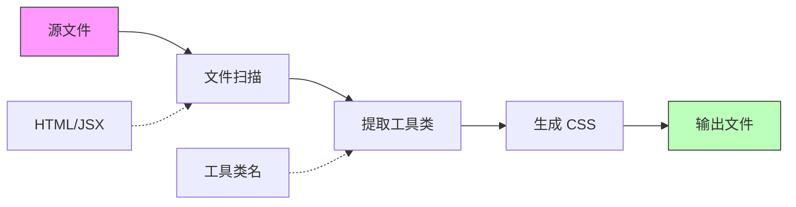
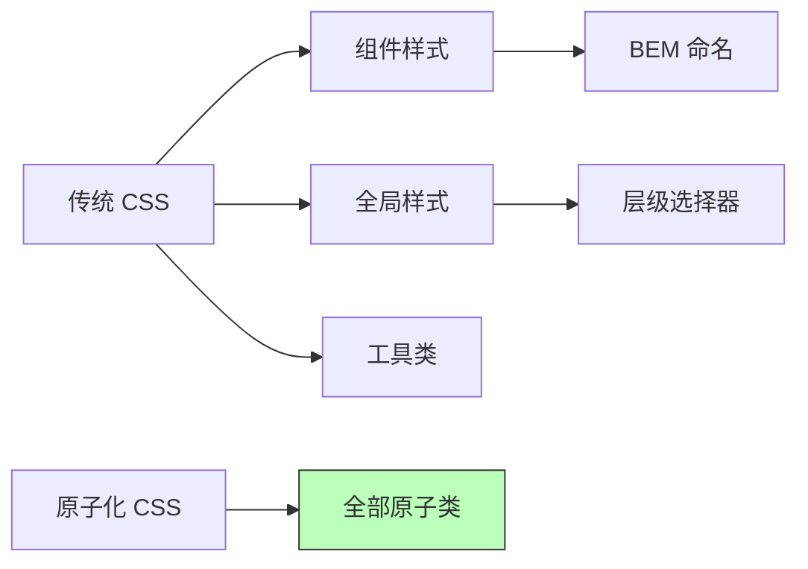
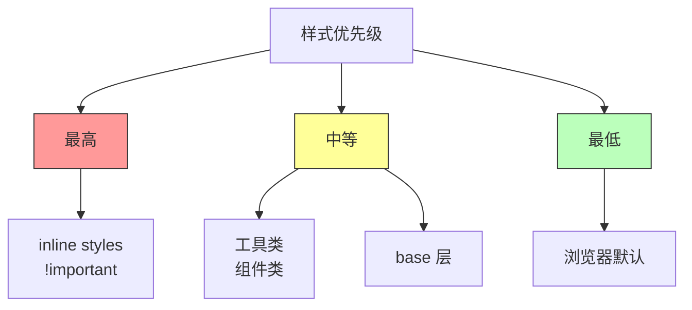
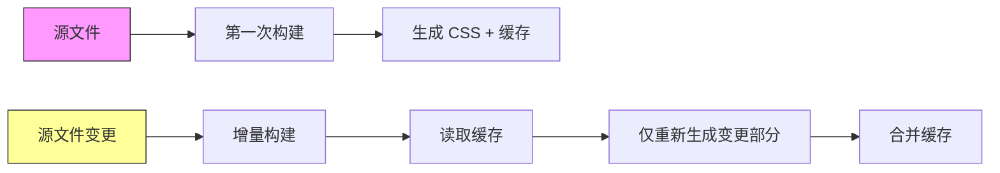
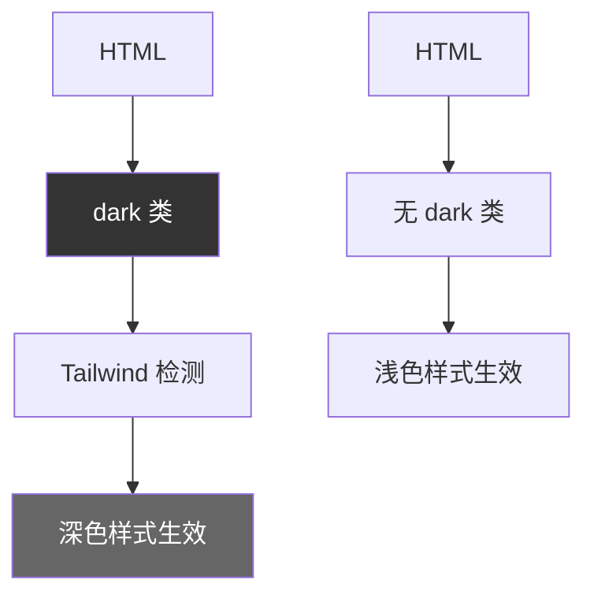
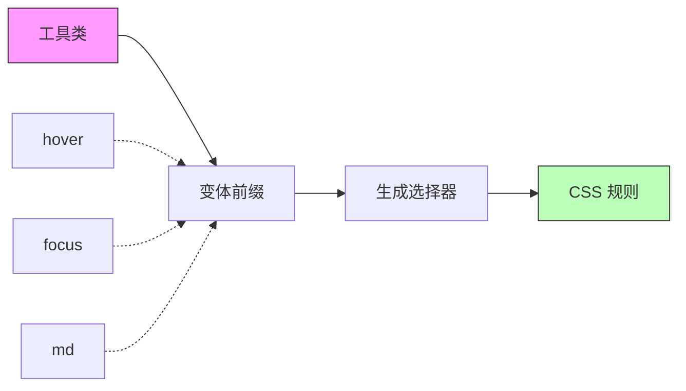
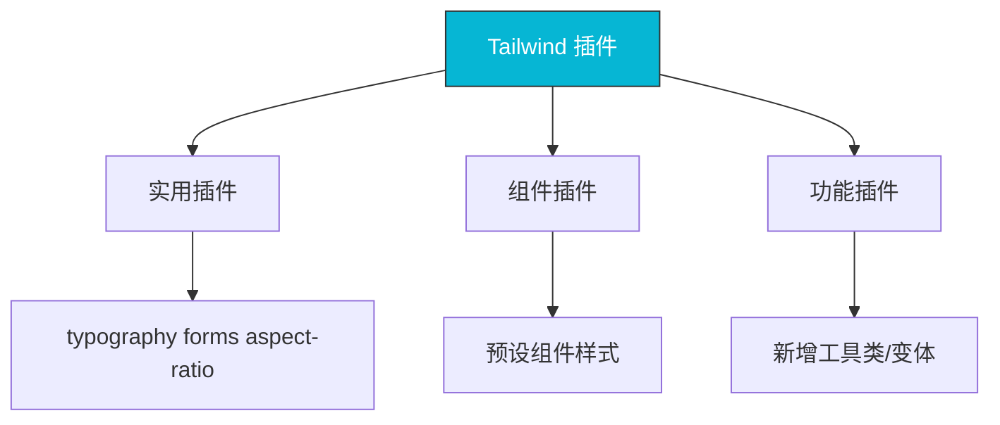

# 原理深度解析

## 0x01 JIT 编译器原理

### 什么是 JIT 编译器

Tailwind CSS 的核心是其 JIT（Just-In-Time）编译器。与传统的 CSS 框架不同，JIT 编译器在构建时按需生成 CSS，而不是预生成所有可能的样式。

```mermaid
graph TB
    A[传统模式] --> B[预生成所有样式]
    B --> C[CSS 文件巨大]
    C --> D[运行时加载全部]
    
    E[JIT 模式] --> F[分析使用的工具类]
    F --> G[按需生成 CSS]
    G --> H[仅包含使用的样式]
    
    style E fill:#06b6d4,stroke:#333,color:#fff
    style H fill:#bfb,stroke:#333
```



### JIT 工作流程



**详细步骤**：

1. **文件扫描**：JIT 编译器扫描 `content` 配置中指定的所有文件
2. **工具类提取**：正则匹配提取所有 Tailwind 工具类
3. **样式生成**：根据提取的工具类生成对应的 CSS 规则
4. **输出优化**：应用 minify 和其他优化

### JIT 生成示例

```html
<!-- 输入：HTML 文件 -->
<div class="bg-blue-500 p-4 text-white">
  Hello World
</div>
```

```css
/* 输出：生成的 CSS */
.bg-blue-500 {
  --tw-bg-opacity: 1;
  background-color: rgb(59 130 246 / var(--tw-bg-opacity));
}

.p-4 {
  padding: 1rem;
}

.text-white {
  --tw-text-opacity: 1;
  color: rgb(255 255 255 / var(--tw-text-opacity));
}
```

### JIT 特性

#### 动态值支持

```html
<!-- 任意数值 -->
<div class="p-[17px]">自定义数值</div>
<div class="mt-[123px]">任意边距</div>

<!-- 任意颜色 -->
<div class="bg-[#1e3a8a]">自定义颜色</div>
<div class="text-[rgba(255,0,0,0.5)]">带透明度的颜色</div>

<!-- 任意属性 -->
<div class="[-webkit-line-clamp:3]">webkit 行数限制</div>
```

#### 变体自动生成

JIT 会自动为所有变体组合生成样式：

```css
/* 基础工具类 */
.text-center { text-align: center; }

/* 变体组合自动生成 */
.sm\:text-center { @media (min-width: 640px) { text-align: center; } }
.md\:text-center { @media (min-width: 768px) { text-align: center; } }
.lg\:text-center { @media (min-width: 1024px) { text-align: center; } }

.hover\:text-center:hover { text-align: center; }
.focus\:text-center:focus { text-align: center; }
```

### JIT 性能优势

| 指标 | 传统模式 | JIT 模式 |
|------|----------|----------|
| 首次构建 | 快 | 快 |
| 增量构建 | 慢 | 极快 |
| CSS 文件大小 | 固定 ~3MB | 按需，可能 < 10KB |
| 热更新 | 慢 | 极快 |

## 0x02 原子化 CSS 架构

### 原子化概念

原子化 CSS（Atomic CSS）是一种 CSS 架构方法，其中每个类只包含一个 CSS 属性。Tailwind CSS 是原子化 CSS 的典型实现。

```css
/* 原子化 CSS 示例 */
.p-4 { padding: 1rem; }
.m-2 { margin: 0.5rem; }
.bg-blue { background-color: blue; }
.text-white { color: white; }

/* 组合使用 */
class="p-4 m-2 bg-blue text-white"
```

### 原子化优势

1. **极小的 CSS 体积**：每个工具类只生成一条 CSS 规则
2. **无样式冲突**：每个类独立，不存在样式覆盖问题
3. **更好的缓存**：CSS 变更时，重建体积最小
4. **一致的样式**：强制使用设计系统的值

### 与传统 CSS 对比



**传统 CSS**：

```css
/* styles.css */
.navbar { background: white; padding: 1rem; }
.navbar__logo { height: 40px; }
.navbar__item { color: gray; }
.navbar__item--active { color: blue; }
```

**原子化 CSS**：

```css
/* 生成的 CSS */
.bg-white { background-color: white; }
.p-4 { padding: 1rem; }
.h-10 { height: 2.5rem; }
.text-gray-600 { color: #4b5563; }
.text-blue-600 { color: #2563eb; }
```

## 0x03 样式生成原理

### CSS 变量系统

Tailwind CSS 大量使用 CSS 自定义属性（CSS Variables）来实现主题化：

```css
/* 生成的 CSS 中 */
.bg-blue-500 {
  /* 使用 CSS 变量 */
  background-color: rgb(59 130 246 / var(--tw-bg-opacity));
}

/* 默认不透明度变量 */
:root {
  --tw-bg-opacity: 1;
}
```

### 任意值转换

Tailwind CSS 的任意值（arbitrary values）语法 `[]` 允许直接注入 CSS 值：

```html
<!-- 语法 -->
<div class="p-[16px]">任意像素值</div>
<div class="text-[1.5rem]">任意 rem 值</div>
<div class="w-[calc(100%-2rem)]">calc 表达式</div>
```

这些值会被转换为对应的 CSS：

```css
.p-\[16px\] {
  padding: 16px;
}

.text-\[1\.5rem\] {
  font-size: 1.5rem;
}

.w-\[calc\(100\%-2rem\)\] {
  width: calc(100% - 2rem);
}
```

### 响应式前缀解析

响应式前缀的工作原理：

```mermaid
graph TB
    A[class="md:flex"] --> B[解析前缀]
    B --> C[md = 768px]
    C --> D[生成媒体查询]
    D --> E[@media (min-width: 768px)]
    E --> F[.md\:flex { display: flex; }]
    
    style A fill:#f9f,stroke:#333
    style F fill:#bfb,stroke:#333
```

## 0x04 样式计算顺序

### 优先级规则

Tailwind CSS 生成的 CSS 遵循以下优先级：



### 变体优先级

```css
/* 变体优先级从低到高 */

/* 1. 基础工具类 */
.flex { display: flex; }

/* 2. 响应式变体 */
@media (min-width: 640px) {
  .sm\:flex { display: flex; }
}

/* 3. 状态变体 */
.hover\:flex:hover { display: flex; }

/* 4. 组合变体 */
.md\:hover\:flex:hover@media (min-width: 768px) {
  display: flex;
}
```

### 层叠顺序

```css
/* @tailwind base - 基础层（最低优先级） */
*, ::before, ::after {
  box-sizing: border-box;
}

/* @tailwind components - 组件层 */
@layer components {
  .my-component { ... }
}

/* @tailwind utilities - 工具层（最高优先级） */
.p-4 { padding: 1rem; }
```

## 0x05 性能优化原理

### Content 扫描优化

`content` 配置决定了需要扫描的文件：

```javascript
// 推荐的配置方式
content: [
  "./src/**/*.{js,jsx,ts,tsx,vue}",
  "./public/**/*.html",
],

// 不推荐的配置（扫描过多文件）
content: ["./**/*"], // 包含 node_modules 等
```

### CSS 缓存机制



### PurgeCSS 集成

Tailwind CSS 内置了与 PurgeCSS 类似的清理机制：

```javascript
// tailwind.config.js
module.exports = {
  content: {
    // 扫描所有文件
    files: [
      "./src/**/*.{html,js,jsx,ts,tsx}",
    ],
  },
  // 这些工具类始终保留
  safelist: [
    'bg-red-500',  // 动态使用的类
    'text-[32px]',  // 任意值类
  ],
}
```

### 生产构建优化

```bash
# 开发模式 - 支持热更新
npx tailwindcss -i ./src/input.css -o ./dist/output.css --watch

# 生产模式 - 压缩和优化
npx tailwindcss -i ./src/input.css -o ./dist/output.css --minify

# 环境变量控制
NODE_ENV=production npx tailwindcss -i ./src/input.css -o ./dist/output.css
```

生产模式下的优化：

1. **移除开发注释**：删除所有调试信息
2. **合并重复规则**：合并相同的 CSS 规则
3. **压缩输出**：移除所有空白和换行
4. **优化选择器**：移除不必要的前缀

## 0x06 深色模式实现原理

### class 策略



**配置**：

```javascript
module.exports = {
  darkMode: 'class', // 使用 class 策略
}
```

**使用**：

```html
<!-- 手动控制 -->
<html class="dark">
  <div class="bg-white dark:bg-gray-900 text-gray-900 dark:text-white">
    智能切换
  </div>
</html>
```

### media 策略

```javascript
module.exports = {
  darkMode: 'media', // 自动跟随系统
}
```

```css
/* 生成的 CSS */
@media (prefers-color-scheme: dark) {
  .dark\:bg-gray-900 {
    background-color: #111827;
  }
}
```

## 0x07 变体生成原理

### 内置变体

Tailwind CSS 自动为每个工具类生成所有变体组合：

```css
/* 基础工具类 */
.text-center { text-align: center; }

/* 响应式变体 */
@media (min-width: 640px) {
  .sm\:text-center { text-align: center; }
}
@media (min-width: 768px) {
  .md\:text-center { text-align: center; }
}

/* 状态变体 */
.hover\:text-center:hover { text-align: center; }
.focus\:text-center:focus { text-align: center; }
.active\:text-center:active { text-align: center; }

/* 组合变体 */
.md\:hover\:text-center:hover@media (min-width: 768px) {
  text-align: center;
}
```

### 变体工作原理



### 自定义变体

```javascript
// tailwind.config.js
module.exports = {
  variants: {
    // 扩展现有变体
    extend: {
      // 自定义变体
      'custom': ['hover', 'focus'],
      // 特定工具类的变体
      'backgroundColor': ['hover', 'focus', 'active', 'odd'],
      'textColor': ['hover', 'focus', 'group-hover'],
    },
  },
}
```

## 0x08 插件系统原理

### 插件类型



### 插件结构

```javascript
// my-plugin.js
module.exports = {
  plugin: function ({ addUtilities, addComponents, addVariant, e }) {
    // 添加工具类
    addUtilities({
      '.rotate-45': {
        transform: 'rotate(45deg)',
      },
    });
    
    // 添加组件样式
    addComponents({
      '.btn': {
        padding: '0.5rem 1rem',
        borderRadius: '0.25rem',
      },
    });
    
    // 添加变体
    addVariant('disabled', '&:disabled');
  },
  // 或使用函数式 API
  fn: ({ addUtilities }) => {
    addUtilities({...});
  },
};
```

### 插件注册

```javascript
// tailwind.config.js
module.exports = {
  plugins: [
    // 本地插件
    require('./my-plugin'),
    
    // npm 插件
    require('@tailwindcss/forms'),
    require('@tailwindcss/typography'),
  ],
}
```

## 最佳实践

1. **理解 JIT 工作原理**：了解工具类是如何按需生成的
2. **优化 content 配置**：确保只扫描需要的文件
3. **使用 CSS 变量**：利用 CSS 变量实现主题化
4. **合理使用任意值**：避免过度使用任意值导致 CSS 体积增大
5. **理解变体优先级**：避免样式冲突

## 参考

- [Tailwind CSS JIT 文档](https://tailwindcss.com/docs/just-in-time)
- [Tailwind CSS 架构](https://tailwindcss.com/docs/architecture)