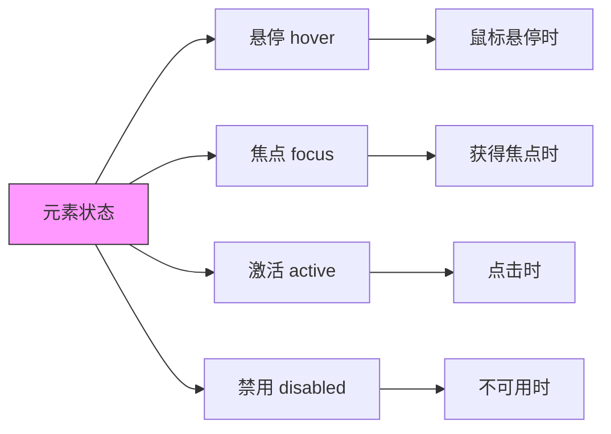
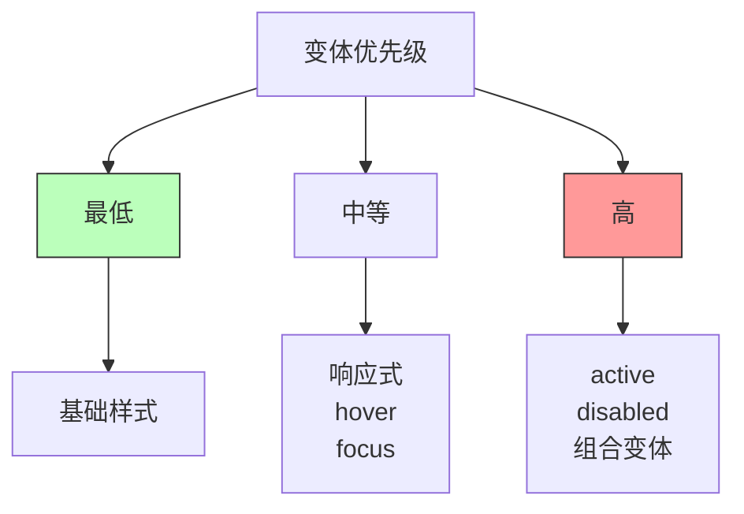

# 状态变体

## 0x01 状态变体概述

状态变体（State Variants）是 Tailwind CSS 中用于处理元素不同状态（如悬停、焦点、激活等）的机制。通过状态变体，可以为元素的不同交互状态定义不同的样式，从而创建丰富的用户交互体验。



## 0x02 常用状态变体

### 悬停状态（hover）

悬停变体在鼠标指针移到元素上时生效：

```html
<!-- 悬停时改变背景色 -->
<button class="bg-blue-500 hover:bg-blue-600 text-white px-4 py-2 rounded">
  悬停效果
</button>

<!-- 悬停时改变文本颜色 -->
<a href="#" class="text-blue-500 hover:text-blue-700">
  链接
</a>

<!-- 悬停时显示阴影 -->
<div class="bg-white hover:shadow-lg transition-shadow p-4">
  悬停显示阴影
</div>

<!-- 悬停时改变透明度 -->


<!-- 悬停时缩放 -->
<button class="hover:scale-105 transition-transform">
  悬停缩放
</button>
```

### 焦点状态（focus）

焦点变体在元素获得键盘焦点时生效，常用于表单元素和可交互元素：

```html
<!-- 焦点时显示轮廓环 -->
<input class="border border-gray-300 focus:ring-2 focus:ring-blue-500 focus:border-blue-500">

<!-- 焦点时改变边框 -->
<button class="border-2 border-transparent focus:border-blue-500">
  焦点边框
</button>

<!-- 焦点时移除轮廓 -->
<input class="focus:outline-none focus:ring-2">

<!-- 焦点时改变透明度 -->
<input class="focus:opacity-100 opacity-75">

<!-- 组合焦点效果 -->
<button class="focus:outline-none focus:ring-2 focus:ring-blue-500 focus:ring-offset-2">
  完整焦点样式
</button>
```

### 激活状态（active）

激活变体在元素被点击时（按下但未释放）生效：

```html
<!-- 点击时改变背景 -->
<button class="bg-blue-500 active:bg-blue-700 text-white">
  点击效果
</button>

<!-- 点击时缩小 -->
<button class="active:scale-95 transition-transform">
  点击缩小
</button>

<!-- 点击时改变透明度 -->
<button class="active:opacity-80">
  点击透明度
</button>
```

### 禁用状态（disabled）

禁用变体在元素被禁用时生效：

```html
<!-- 禁用时降低透明度 -->
<button class="disabled:opacity-50 disabled:cursor-not-allowed" disabled>
  禁用按钮
</button>

<!-- 禁用时改变颜色 -->
<input class="disabled:bg-gray-100 disabled:text-gray-400" disabled>

<!-- 禁用时禁止-events -->
<a href="#" class="disabled:pointer-events-none">
  不可点击链接
</a>
```

## 0x03 伪类变体详解

### 第一个/最后一个（first/last）

```html
<!-- 第一个元素 -->
<ul class="list-none">
  <li class="first:text-blue-500">第一项</li>
  <li>第二项</li>
  <li>第三项</li>
</ul>

<!-- 最后一个元素 -->
<ul class="list-none">
  <li>第一项</li>
  <li>第二项</li>
  <li class="last:text-red-500">最后一项</li>
</ul>

<!-- 第一个和最后一个组合 -->
<div class="first:rounded-l-lg last:rounded-r-lg">
  组合圆角
</div>
```

### 奇数/偶数（odd/even）

```html
<!-- 奇数行样式 -->
<ul class="divide-y">
  <li class="odd:bg-gray-50">项目 1</li>
  <li class="odd:bg-gray-50">项目 2</li>
  <li class="odd:bg-gray-50">项目 3</li>
</ul>

<!-- 偶数行样式 -->
<tr class="even:bg-gray-100">偶数行</tr>

<!-- 斑马纹效果 -->
<div class="divide-y divide-gray-200">
  <div class="odd:bg-white even:bg-gray-50 py-2">行</div>
</div>
```

### 唯一元素（only）

```html
<!-- 唯一子元素 -->
<div class="only:bg-blue-100">
  唯一的子元素
</div>
```

### 选中状态（checked）

```html
<!-- 选中的复选框 -->
<input type="checkbox" class="w-5 h-5 checked:bg-blue-500 checked:border-transparent">

<!-- 选中的单选框 -->
<input type="radio" class="radio checked:bg-blue-500">

<!-- 选中时显示图标 -->
<label class="flex items-center">
  <input type="checkbox" class="peer sr-only">
  <span class="w-6 h-6 border-2 border-gray-300 peer-checked:bg-blue-500 rounded">
    ✓
  </span>
</label>
```

### 必填/可选（required/optional）

```html
<!-- 必填字段样式 -->
<input class="required:border-red-500" required>

<!-- 可选字段样式 -->
<input class="optional:text-gray-400" optional>
```

### 有效/无效（valid/invalid）

```html
<!-- 有效状态 -->
<input class="valid:border-green-500 valid:text-green-700" type="email">

<!-- 无效状态 -->
<input class="invalid:border-red-500 invalid:text-red-700" type="email">

<!-- 结合验证 -->
<input type="email" class="invalid:border-red-500 focus:invalid:ring-red-500 valid:border-green-500">
```

### 占位符（placeholder）

```html
<!-- 占位符样式 -->
<input class="placeholder-gray-400" placeholder="请输入内容">

<!-- 焦点时占位符样式 -->
<input class="placeholder-gray-400 focus:placeholder-gray-600" placeholder="输入时变暗">
```

### 读写状态（read-only/read-write）

```html
<!-- 只读状态 -->
<input class="read-only:bg-gray-100 read-only:cursor-not-allowed" readonly>

<!-- 可读写状态 -->
<textarea class="read-write:bg-white">
```

## 0x04 分组变体（Group Variants）

分组变体允许在父元素状态变化时影响子元素：

```html
<!-- 父元素悬停，子元素变化 -->
<div class="group hover:bg-blue-500">
  <p class="group-hover:text-white text-gray-900">
    父元素悬停时子元素变白
  </p>
</div>

<!-- 组合示例 -->
<div class="group relative">
  
  <div class="absolute inset-0 flex items-center justify-center opacity-0 group-hover:opacity-100">
    <span class="text-white">查看</span>
  </div>
</div>

<!-- 分组焦点 -->
<button class="group">
  <span class="group-focus:text-blue-500">图标</span>
  <span class="group-focus:font-bold">文字</span>
</button>
```

### 命名分组

可以为分组设置自定义名称：

```html
<!-- 父元素设置分组名 -->
<div class="group/item hover:bg-gray-100">
  <div class="group-hover/item:text-blue-500">
    悬停时变蓝
  </div>
</div>

<!-- 多个分组 -->
<div class="group-a group-b">
  <span class="group-hover/a:text-red group-hover/b:text-blue">
    响应不同分组
  </span>
</div>
```

## 0x05 响应式状态变体

可以将状态变体与响应式前缀组合使用：

```html
<!-- 桌面端悬停效果 -->
<button class="hover:bg-blue-600 md:hover:bg-blue-700 lg:hover:bg-blue-800">
  响应式悬停
</button>

<!-- 仅在特定断点启用悬停 -->
<div class="hidden md:block hover:bg-gray-100">
  桌面端悬停
</div>

<!-- 组合多个变体 -->
<input class="focus:ring-2 focus:ring-blue-500 md:focus:ring-4 md:focus:ring-blue-300">
```

## 0x06 自定义状态变体

### 通过配置添加

在 `tailwind.config.js` 中添加自定义变体：

```javascript
module.exports = {
  theme: {
    extend: {
      variants: {
        // 添加自定义变体
        extend: {
          // 基于伪类
          'touched': ['hover', 'focus'],
          // 基于选择器
          'group-touched': ['group-hover', 'group-focus'],
        },
      },
    },
  },
}
```

### 通过插件添加

创建自定义插件：

```javascript
// my-variant-plugin.js
module.exports = function ({ addVariant }) {
  // 添加自定义变体
  addVariant('hocus', ['&:hover', '&:focus']);
  addVariant('group-hocus', ['.group:hover &', '.group:focus &']);
  
  // 基于数据属性
  addVariant('data-checked', '&[data-checked]');
  addVariant('data-active', '&[data-active="true"]');
}
```

使用插件：

```javascript
// tailwind.config.js
module.exports = {
  plugins: [
    require('./my-variant-plugin'),
  ],
}
```

## 0x07 使用示例

### 完整按钮组件

```html
<!-- 完整状态按钮 -->
<button 
  class="
    bg-blue-500 
    hover:bg-blue-600 
    focus:outline-none 
    focus:ring-2 
    focus:ring-blue-500 
    focus:ring-offset-2
    active:bg-blue-700 
    disabled:opacity-50 
    disabled:cursor-not-allowed
    text-white 
    font-semibold 
    py-2 
    px-4 
    rounded 
    transition-colors
  "
  disabled
>
  按钮
</button>
```

### 卡片悬停效果

```html
<!-- 卡片悬停效果 -->
<div class="group bg-white rounded-lg shadow-md overflow-hidden hover:shadow-xl transition-all duration-300">
  
  <div class="p-4">
    <h3 class="text-lg font-semibold text-gray-900 group-hover:text-blue-600 transition-colors">
      标题
    </h3>
    <p class="text-gray-600 mt-2 group-hover:text-gray-700">
      描述内容...
    </p>
  </div>
</div>
```

### 表单验证状态

```html
<!-- 表单验证示例 -->
<form class="space-y-4">
  <div>
    <label class="block text-sm font-medium text-gray-700">邮箱</label>
    <input 
      type="email" 
      class="
        mt-1 
        block 
        w-full 
        rounded-md 
        border-gray-300 
        shadow-sm
        focus:border-blue-500 
        focus:ring 
        focus:ring-blue-200 
        focus:ring-opacity-50
        invalid:border-red-500 
        invalid:text-red-600
        valid:border-green-500
      "
      placeholder="you@example.com"
      required
    >
    <p class="mt-1 text-sm text-gray-500">请输入有效的邮箱地址</p>
  </div>
  
  <div>
    <label class="block text-sm font-medium text-gray-700">密码</label>
    <input 
      type="password" 
      class="
        mt-1 
        block 
        w-full 
        rounded-md 
        border-gray-300 
        shadow-sm
        focus:border-blue-500 
        focus:ring 
        focus:ring-blue-200
        disabled:bg-gray-100 
        disabled:cursor-not-allowed
      "
      disabled
    >
  </div>
</form>
```

### 列表交互效果

```html
<!-- 列表交互 -->
<ul class="divide-y divide-gray-200">
  <li class="group flex items-center justify-between p-4 hover:bg-gray-50 transition-colors cursor-pointer">
    <div class="flex items-center">
      <div class="w-10 h-10 rounded-full bg-blue-500 flex items-center justify-center text-white group-hover:scale-110 transition-transform">
        A
      </div>
      <div class="ml-4">
        <p class="text-sm font-medium text-gray-900 group-hover:text-blue-600">
          项目名称
        </p>
        <p class="text-sm text-gray-500">
          描述信息
        </p>
      </div>
    </div>
    <div class="opacity-0 group-hover:opacity-100 transition-opacity">
      <span class="text-blue-500 text-sm">查看 →</span>
    </div>
  </li>
</ul>
```

## 0x08 最佳实践

### 变体优先级

当多个变体同时作用时，优先级从低到高为：



### 性能注意事项

1. **避免过多变体**：每个变体都会生成额外的 CSS
2. **合理使用 group**：分组变体可能影响性能
3. **测试实际效果**：在真实设备上测试交互效果

### 可访问性

1. **始终提供焦点样式**：确保键盘用户知道当前焦点位置
2. **保持足够的对比度**：悬停和焦点状态应清晰可见
3. **禁用状态应明显**：禁用元素应清晰表明不可用

## 参考

- [Tailwind CSS 状态变体文档](https://tailwindcss.com/docs/hover-focus-and-other-states)