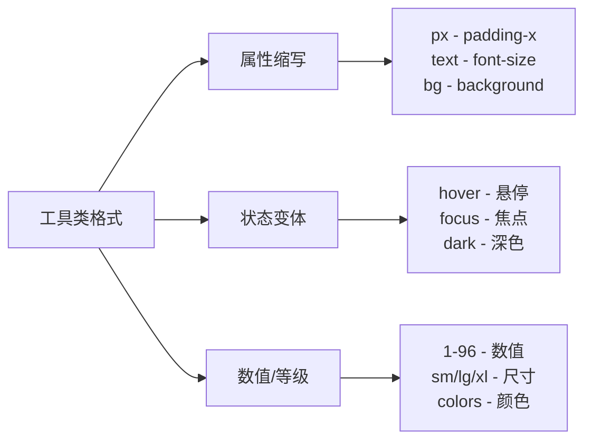
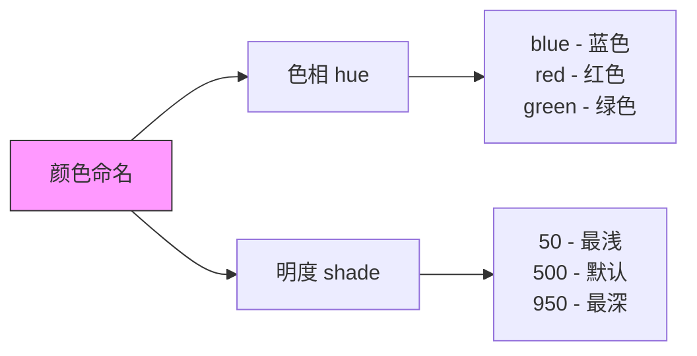
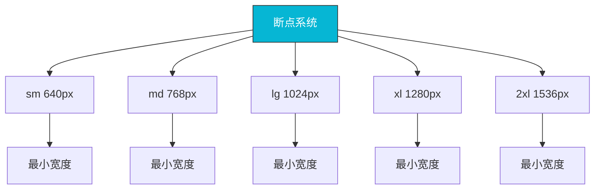

# 核心概念

## 0x01 工具类（Utility Classes）

### 什么是工具类

工具类是 Tailwind CSS 的核心概念。每个工具类只负责一种样式属性，通过组合多个工具类来实现复杂的样式效果。

```css
/* 传统 CSS：编写组件样式 */
.button {
  background-color: #3b82f6;
  color: white;
  padding: 0.5rem 1rem;
  border-radius: 0.25rem;
  font-weight: 600;
  transition: all 0.2s;
}

.button:hover {
  background-color: #2563eb;
}

/* Tailwind CSS：组合工具类 */
<button class="bg-blue-500 text-white px-4 py-2 rounded-md font-semibold transition-colors hover:bg-blue-600">
  点击我
</button>
```

### 工具类命名规范

Tailwind CSS 的工具类命名遵循一致的规范，便于理解和记忆：



**常见属性缩写**：

| 缩写 | 原词 | 含义 |
|------|------|------|
| p | padding | 内边距 |
| m | margin | 外边距 |
| w | width | 宽度 |
| h | height | 高度 |
| text | text | 文本相关 |
| bg | background | 背景 |
| flex | flexbox | 弹性盒 |
| grid | grid | 网格布局 |
| absolute | absolute | 绝对定位 |
| relative | relative | 相对定位 |

## 0x02 层叠机制（Layers）

Tailwind CSS 将样式分为三个层叠顺序，使用 `@tailwind` 指令导入：

```css
/* 1. @tailwind base - 基础层 */
@tailwind base;

/* 2. @tailwind components - 组件层 */
@tailwind components;

/* 3. @tailwind utilities - 工具层 */
@tailwind utilities;
```

### Base（基础层）

基础层包含 CSS 重置（normalize）和基础样式：

```css
/* 生成的 base 层样式 */
*, ::before, ::after {
  box-sizing: border-box;
  border-width: 0;
  border-style: solid;
  border-color: #e5e7eb;
}

html {
  line-height: 1.5;
  -webkit-text-size-adjust: 100%;
  tab-size: 4;
}

body {
  line-height: inherit;
}
```

### Components（组件层）

组件层用于定义可复用的组件样式：

```css
/* 在 CSS 中使用 @layer components */
@layer components {
  .card {
    @apply bg-white rounded-lg shadow-md p-6;
  }
  
  .btn {
    @apply px-4 py-2 rounded font-medium transition-colors;
  }
  
  .btn-primary {
    @apply bg-blue-500 text-white hover:bg-blue-600;
  }
}
```

### Utilities（工具层）

工具层包含所有工具类，这是 Tailwind CSS 的核心：

```css
/* 示例工具类 */
.p-4 { padding: 1rem; }
.text-center { text-align: center; }
.flex { display: flex; }
.bg-gray-100 { background-color: #f3f4f6; }
```

### 层叠顺序

```mermaid
graph TD
    A[CSS 层叠顺序] --> B[低优先级]
    A --> C[中优先级]
    A --> D[高优先级]
    
    B --> B1[@tailwind base]
    C --> C1[@tailwind components]
    D --> D1[@tailwind utilities]
    
    B1 --> E1[基础样式]
    C1 --> E2[组件样式]
    D1 --> E3[工具类]
    
    style A fill:#f9f,stroke:#333
    style D fill:#bfb,stroke:#333
```

## 0x03 变体（Variants）

变体允许你在特定条件下应用样式，常见的变体包括响应式和状态变体。

### 响应式变体

响应式变体基于断点实现移动优先的设计：

```css
/* 基础：默认是 mobile first */
<div class="block">

<!-- 响应式断点：
  sm - 640px
  md - 768px
  lg - 1024px
  xl - 1280px
  2xl - 1536px
*/

<!-- 在特定断点应用样式 -->
<div class="block md:flex lg:w-1/2">
```

### 状态变体

状态变体用于处理元素的不同状态：

```html
<!-- 鼠标悬停 -->
<button class="bg-blue-500 hover:bg-blue-600">Hover Me</button>

<!-- 获取焦点 -->
<input class="border focus:border-blue-500 focus:ring" />

<!-- 激活状态 -->
<button class="active:bg-blue-700">Active</button>

<!-- 禁用状态 -->
<button class="disabled:opacity-50" disabled>Disabled</button>
```

### 变体组合

多个变体可以组合使用：

```html
<!-- 响应式 + 状态 -->
<button class="bg-blue-500 hover:bg-blue-600 md:bg-green-500 md:hover:bg-green-600">
  组合变体
</button>
```

### 自定义变体

在配置文件中添加自定义变体：

```javascript
module.exports = {
  theme: {
    extend: {
      variants: {
        // 添加自定义变体
        extend: {
          'custom-variant': ['hover', 'focus'],
        },
      },
    },
  },
}
```

## 0x04 设计系统（Design System）

Tailwind CSS 内置了一个完整的设计系统，包括颜色、间距、字体等。

### 颜色系统

Tailwind 提供了丰富的颜色调色板：



**常用颜色示例**：

```html
<!-- 蓝色 - 50 到 900 -->
<div class="bg-blue-50">bg-blue-50</div>
<div class="bg-blue-100">bg-blue-100</div>
<div class="bg-blue-500">bg-blue-500</div>
<div class="bg-blue-900">bg-blue-900</div>

<!-- 文本颜色 -->
<p class="text-gray-500">text-gray-500</p>
<p class="text-red-600">text-red-600</p>

<!-- 边框颜色 -->
<div class="border border-indigo-500"></div>
```

### 间距系统

基于 0.25rem（4px）倍数：

```css
/* 0 到 96 的间距 */
.m-0 { margin: 0px; }
.m-1 { margin: 0.25rem; }
.m-2 { margin: 0.5rem; }
.m-4 { margin: 1rem; }
.m-8 { margin: 2rem; }
/* ... */
.m-96 { margin: 24rem; }

/* 负间距 */
.-m-4 { margin: -1rem; }
```

### 字体系统

```html
<!-- 字体大小 -->
<p class="text-xs">text-xs - 0.75rem</p>
<p class="text-sm">text-sm - 0.875rem</p>
<p class="text-base">text-base - 1rem</p>
<p class="text-lg">text-lg - 1.125rem</p>
<p class="text-xl">text-xl - 1.25rem</p>
<p class="text-2xl">text-2xl - 1.5rem</p>

<!-- 字体粗细 -->
<p class="font-light">font-light - 300</p>
<p class="font-normal">font-normal - 400</p>
<p class="font-medium">font-medium - 500</p>
<p class="font-bold">font-bold - 700</p>
```

### 圆角系统

```html
<!-- 圆角大小 -->
<div class="rounded-sm"></div>
<div class="rounded"></div>
<div class="rounded-md"></div>
<div class="rounded-lg"></div>
<div class="rounded-xl"></div>
<div class="rounded-2xl"></div>
<div class="rounded-full"></div>
```

## 0x05 @apply 指令

`@apply` 指令允许在自定义 CSS 中使用工具类：

```css
/* 在组件层中使用 */
@layer components {
  .btn-primary {
    @apply bg-blue-500 text-white px-4 py-2 rounded-lg font-medium;
  }
  
  .card {
    @apply bg-white shadow-lg rounded-xl p-6;
  }
  
  .input-field {
    @apply w-full px-3 py-2 border border-gray-300 rounded-md focus:outline-none focus:ring-2 focus:ring-blue-500;
  }
}

/* 在工具层中使用 */
@layer utilities {
  .text-balance {
    text-wrap: balance;
  }
  
  .scrollbar-hide {
    -ms-overflow-style: none;
    scrollbar-width: none;
  }
  
  .scrollbar-hide::-webkit-scrollbar {
    display: none;
  }
}
```

### @layer 指令

`@layer` 指令用于将样式放入特定的层：

```css
/* 自动归类到 components 层 */
@layer components {
  .my-component { ... }
}

/* 自动归类到 utilities 层 */
@layer utilities {
  .my-utility { ... }
}

/* 默认归类到 base 层 */
@layer base {
  html { ... }
}
```

### @config 指令

指定使用的配置文件：

```css
/* 使用默认配置 */
@tailwind base;

/* 指定自定义配置 */
@config "./tailwind.custom.config.js";

/* 然后使用自定义配置中的工具类 */
<div class="text-custom-color">...</div>
```

## 0x06 响应式设计

Tailwind CSS 采用移动优先（mobile-first）的响应式设计方法。

### 断点系统



### 移动优先语法

```html
<!-- 基础类（移动端） -->
<div class="text-base">

<!-- 在更大屏幕应用不同样式 -->
<div class="text-base md:text-lg lg:text-xl">
```

### 自定义断点

```javascript
// tailwind.config.js
module.exports = {
  theme: {
    screens: {
      'xs': '480px',    // 自定义小断点
      'sm': '640px',    // 默认
      'md': '768px',    // 默认
      'lg': '1024px',   // 默认
      'xl': '1280px',   // 默认
      '2xl': '1536px',  // 默认
      '3xl': '1920px',  // 自定义大断点
    },
  },
}
```

## 0x07 深色模式

Tailwind CSS 内置深色模式支持。

### 启用深色模式

```javascript
// tailwind.config.js

// 方式一：使用 class 策略
module.exports = {
  darkMode: 'class', // 手动控制
}

// 方式二：使用 media 策略（自动跟随系统）
module.exports = {
  darkMode: 'media',
}
```

### 使用深色模式

```html
<!-- 使用 class 策略 -->
<html class="dark">
  <body class="bg-white dark:bg-gray-900">
    <div class="text-gray-900 dark:text-white">
      智能切换颜色
    </div>
  </body>
</html>
```

## 最佳实践

1. **优先使用工具类**：尽量直接组合工具类，减少自定义 CSS
2. **合理使用 @apply**：复杂样式可使用 @apply，但避免滥用
3. **响应式优先**：先为移动端设计，再逐步增加响应式断点
4. **使用变体**：充分利用 hover、focus 等变体处理交互状态
5. **保持一致性**：使用设计系统的默认值，保持视觉一致性

## 参考

- [Tailwind CSS 官方文档](https://tailwindcss.com/docs)
- [Tailwind CSS 工具类](https://tailwindcss.com/docs/utility-first)
- [Tailwind CSS 响应式设计](https://tailwindcss.com/docs/responsive-design)