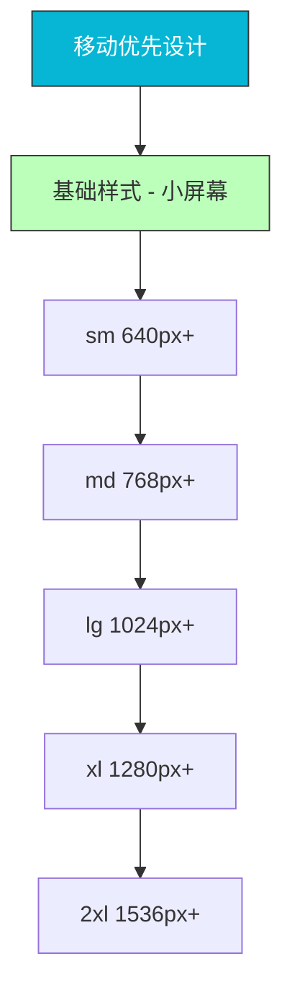
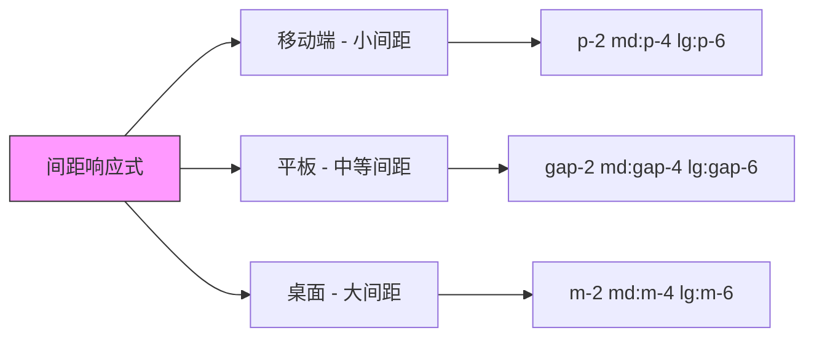

# 响应式设计

## 0x01 移动优先设计理念

Tailwind CSS 采用移动优先（Mobile-First）的响应式设计方法。这意味着基础样式针对小屏幕设备，然后通过断点逐步增强大屏幕的样式。



### 语法示例

```html
<!-- 默认样式（移动端） -->
<div class="block">

<!-- 中断点及以上应用不同样式 -->
<div class="block md:flex">

<!-- 组合多个断点 -->
<div class="text-sm md:text-base lg:text-lg xl:text-xl">
```

## 0x02 断点系统详解

### 默认断点

| 断点 | 最小宽度 | CSS 媒体查询 |
|------|----------|--------------|
| `sm` | 640px | `@media (min-width: 640px)` |
| `md` | 768px | `@media (min-width: 768px)` |
| `lg` | 1024px | `@media (min-width: 1024px)` |
| `xl` | 1280px | `@media (min-width: 1280px)` |
| `2xl` | 1536px | `@media (min-width: 1536px)` |

### 自定义断点

```javascript
// tailwind.config.js
module.exports = {
  theme: {
    screens: {
      'xs': '480px',    // 自定义小断点
      'sm': '640px',
      'md': '768px',
      'lg': '1024px',
      'xl': '1280px',
      '2xl': '1536px',
      '3xl': '1920px',  // 自定义大断点
      // 还可以使用其他单位
      'tablet': '1024px',
      'laptop': '1280px',
      'desktop': '1920px',
    },
  },
}
```

### 最大宽度断点

使用 `max-` 前缀创建最大宽度断点：

```html
<!-- 640px 以下应用 -->
<div class="max-sm:block">

<!-- 768px 以下应用 -->
<div class="max-md:hidden">

<!-- 1024px 以下应用 -->
<div class="max-lg:flex">
```

## 0x03 响应式工具类示例

### 显示属性

```html
<!-- 移动端隐藏，大屏幕显示 -->
<div class="hidden md:block">

<!-- 移动端显示，大屏幕隐藏 -->
<div class="block md:hidden">

<!-- 响应式显示属性 -->
<div class="block md:flex lg:grid">
```

### 尺寸响应式

```html
<!-- 宽度响应式 -->
<div class="w-full md:w-1/2 lg:w-1/3 xl:w-1/4">
  响应式宽度
</div>

<!-- 字体大小响应式 -->
<h1 class="text-2xl md:text-3xl lg:text-4xl xl:text-5xl">
  响应式标题
</h1>

<!-- 内边距响应式 -->
<div class="p-4 md:p-6 lg:p-8 xl:p-12">
  响应式内边距
</div>
```

### 布局响应式

```html
<!-- 移动端单列，大屏幕多列 -->
<div class="grid grid-cols-1 md:grid-cols-2 lg:grid-cols-3 xl:grid-cols-4 gap-4">
  <div class="bg-white p-4">Item 1</div>
  <div class="bg-white p-4">Item 2</div>
  <div class="bg-white p-4">Item 3</div>
  <div class="bg-white p-4">Item 4</div>
</div>

<!-- Flexbox 响应式 -->
<div class="flex flex-col md:flex-row">
  <div class="w-full md:w-1/2">左侧</div>
  <div class="w-full md:w-1/2">右侧</div>
</div>
```

## 0x04 响应式导航栏示例

```html
<!-- 响应式导航栏 -->
<nav class="flex items-center justify-between flex-wrap bg-blue-500 p-6">
  <div class="flex items-center flex-shrink-0 text-white mr-6">
    <span class="font-semibold text-xl tracking-tight">Logo</span>
  </div>
  
  <div class="block lg:hidden">
    <button class="flex items-center px-3 py-2 border rounded text-white border-white">
      <svg class="fill-current h-3 w-3" viewBox="0 0 20 20">
        <path d="M0 3h20v2H0V3zm0 6h20v2H0V9zm0 6h20v2H0v-2z"/>
      </svg>
    </button>
  </div>
  
  <div class="w-full block flex-grow lg:flex lg:items-center lg:w-auto">
    <div class="text-sm lg:flex-grow">
      <a href="#" class="block mt-4 lg:inline-block lg:mt-0 text-white mr-4">
        首页
      </a>
      <a href="#" class="block mt-4 lg:inline-block lg:mt-0 text-white mr-4">
        关于
      </a>
      <a href="#" class="block mt-4 lg:inline-block lg:mt-0 text-white">
        联系方式
      </a>
    </div>
  </div>
</nav>
```

## 0x05 响应式卡片网格

```html
<!-- 响应式卡片网格布局 -->
<div class="container mx-auto px-4 py-8">
  <div class="grid grid-cols-1 sm:grid-cols-2 md:grid-cols-3 lg:grid-cols-4 gap-6">
    
    <!-- 卡片 1 -->
    <div class="bg-white rounded-lg shadow-md overflow-hidden hover:shadow-lg transition-shadow">
      
      <div class="p-4">
        <h3 class="text-lg font-semibold text-gray-900 mb-2">标题 1</h3>
        <p class="text-gray-600 text-sm">描述内容...</p>
      </div>
    </div>
    
    <!-- 卡片 2 -->
    <div class="bg-white rounded-lg shadow-md overflow-hidden hover:shadow-lg transition-shadow">
      
      <div class="p-4">
        <h3 class="text-lg font-semibold text-gray-900 mb-2">标题 2</h3>
        <p class="text-gray-600 text-sm">描述内容...</p>
      </div>
    </div>
    
    <!-- 卡片 3 -->
    <div class="bg-white rounded-lg shadow-md overflow-hidden hover:shadow-lg transition-shadow">
      
      <div class="p-4">
        <h3 class="text-lg font-semibold text-gray-900 mb-2">标题 3</h3>
        <p class="text-gray-600 text-sm">描述内容...</p>
      </div>
    </div>
    
    <!-- 卡片 4 -->
    <div class="bg-white rounded-lg shadow-md overflow-hidden hover:shadow-lg transition-shadow">
      
      <div class="p-4">
        <h3 class="text-lg font-semibold text-gray-900 mb-2">标题 4</h3>
        <p class="text-gray-600 text-sm">描述内容...</p>
      </div>
    </div>
    
  </div>
</div>
```

## 0x06 响应式图片处理

```html
<!-- 响应式图片 -->


<!-- 背景图片响应式 -->
<div class="bg-[url('/mobile.jpg')] md:bg-[url('/desktop.jpg')] bg-cover bg-center h-64">
</div>

<!-- 响应式头像 -->
<div class="h-8 w-8 sm:h-10 sm:w-10 md:h-12 md:w-12 rounded-full overflow-hidden">
  
</div>
```

## 0x07 响应式文本处理

```html
<!-- 响应式文本大小 -->
<p class="text-sm sm:text-base md:text-lg lg:text-xl">
  响应式段落文本，随着屏幕变大而增大
</p>

<!-- 响应式文本对齐 -->
<p class="text-left md:text-center lg:text-right">
  小屏幕左对齐，中等屏幕居中，大屏幕右对齐
</p>

<!-- 响应式字体粗细 -->
<p class="font-normal md:font-medium lg:font-semibold">
  响应式字体粗细
</p>

<!-- 长文本处理 -->
<p class="truncate">这是一段很长的文本超出容器部分会被截断...</p>
<p class="text-ellipsis overflow-hidden whitespace-nowrap">同样效果的另一种写法</p>
```

## 0x08 响应式间距系统



### 间距响应式示例

```html
<!-- 容器响应式间距 -->
<div class="px-2 sm:px-4 md:px-6 lg:px-8">
  内容
</div>

<!-- 网格间距响应式 -->
<div class="grid grid-cols-2 gap-2 md:gap-4 lg:gap-6 xl:gap-8">
  <div>Item</div>
  <div>Item</div>
</div>

<!-- Flex 间距响应式 -->
<div class="flex gap-2 md:gap-4 lg:gap-6">
  <div>Item</div>
  <div>Item</div>
</div>
```

## 0x09 打印样式

Tailwind CSS 还支持打印样式：

```html
<!-- 屏幕显示，打印隐藏 -->
<div class="block print:hidden">
  这部分只在屏幕显示
</div>

<!-- 屏幕隐藏，打印显示 -->
<div class="hidden print:block">
  这部分只在打印时显示
</div>

<!-- 打印时文本颜色 -->
<p class="print:text-black">
  打印时使用黑色
</p>

<!-- 打印时链接显示完整 URL -->
<p class="print:text-sm">
  <a href="https://example.com" class="print:after:content-['('attr(href)')']">
    链接
  </a>
</p>
```

## 最佳实践

1. **优先移动端**：先为小屏幕设计基础样式
2. **渐进增强**：使用 `md:`、`lg:` 等断点逐步增强
3. **避免过度响应式**：不要为每个像素变化都设置断点
4. **测试真实设备**：在真实设备上测试响应式效果
5. **使用相对单位**：使用 rem、em 等相对单位而非固定像素

## 参考

- [Tailwind CSS 响应式设计文档](https://tailwindcss.com/docs/responsive-design)