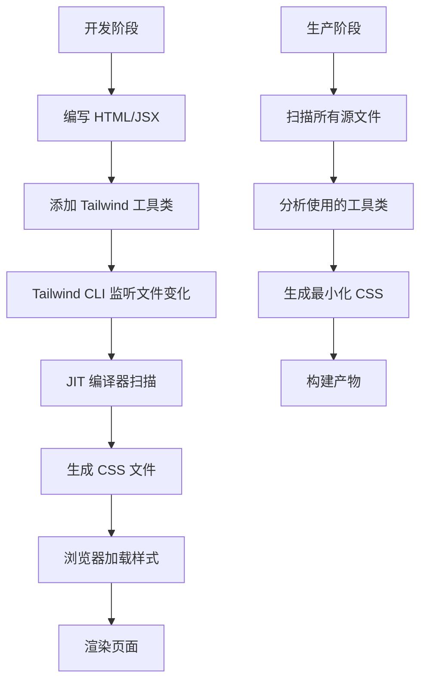
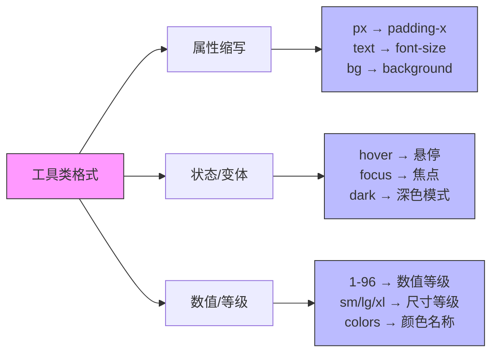

# Tailwind CSS 概述

## 简介

Tailwind CSS 是一个 utility-first（工具优先）的 CSS 框架，它完全颠覆了传统 CSS 的开发方式。与传统的组件化 CSS 框架（如 Bootstrap）不同，Tailwind CSS 不提供预制的组件，而是提供大量的低层级工具类（utility classes），通过组合这些工具类来构建现代化的用户界面。

### 核心理念

Tailwind CSS 的核心理念可以概括为「组合优于继承」：

```html
<!-- 传统方式：编写自定义 CSS -->
<button class="btn-primary">点击我</button>

<style>
.btn-primary {
  background-color: #3b82f6;
  color: white;
  padding: 0.5rem 1rem;
  border-radius: 0.25rem;
  font-weight: 600;
}
</style>

<!-- Tailwind CSS：组合工具类 -->
<button class="bg-blue-500 text-white px-4 py-2 rounded-md font-semibold">
  点击我
</button>
```

### 为什么选择 Tailwind CSS

| 特性 | 传统 CSS | 组件化框架（如 Bootstrap） | Tailwind CSS |
|------|----------|---------------------------|--------------|
| 学习曲线 | 低 | 中 | 中 |
| 样式复用 | 依赖 BEM 等命名规范 | 提供预制组件 | 组合工具类 |
| 自定义程度 | 高 | 受限 | 高 |
| 包体积 | 小 | 大 | 极小（按需生成） |
| 维护性 | 困难（样式冲突） | 中等 | 好（样式与模板同处） |

### Tailwind CSS 的优势

1. **无需离开 HTML**：所有的样式都在 HTML 中完成，减少上下文切换
2. **原子化 CSS**：每个类只做一件事，组合使用极其灵活
3. **JIT 编译器**：仅生成实际使用的 CSS，极大减小包体积
4. **响应式设计**：内置响应式工具类，支持移动优先的设计
5. **深度的自定义能力**：通过配置文件完全定制设计系统
6. **深色模式支持**：开箱即用的深色模式支持

## 工作原理

Tailwind CSS 的核心在于其 JIT（Just-In-Time）编译器，它在构建时分析你的 HTML 和 CSS 文件，只生成实际使用的样式。



### 工具类命名规范

Tailwind CSS 的工具类命名遵循一致的规范，便于理解和记忆：



**命名模式示例**：

```css
/* 格式：[属性缩写]-[状态变体]-[数值/颜色] */

/* 颜色 */
.bg-blue-500    /* background-color: #3b82f6; */
.text-gray-700  /* color: #374151; */

/* 间距 */
.p-4           /* padding: 1rem; */
.mt-2           /* margin-top: 0.5rem; */

/* 尺寸 */
.w-full         /* width: 100%; */
.h-screen       /* height: 100vh; */

/* 响应式 */
.md:block       /* @media (min-width: 768px) { display: block; } */
.lg:w-1/2       /* @media (min-width: 1024px) { width: 50%; } */

/* 状态变体 */
.hover:bg-red-500 /* 鼠标悬停时背景变为红色 */
.focus:outline   /* 获得焦点时显示轮廓 */
```

## 快速开始

### 通过 npm 安装

```bash
# 创建新项目
npm init -y

# 安装 Tailwind CSS 及相关依赖
npm install -D tailwindcss postcss autoprefixer

# 初始化配置文件
npx tailwindcss init -p
```

### 配置 tailwind.config.js

```javascript
/** @type {import('tailwindcss').Config} */
module.exports = {
  content: [
    "./src/**/*.{html,js}",
  ],
  theme: {
    extend: {},
  },
  plugins: [],
}
```

### 添加 Tailwind 到 CSS

```css
/* src/input.css */
@tailwind base;
@tailwind components;
@tailwind utilities;
```

### 构建命令

```json
{
  "scripts": {
    "dev": "tailwindcss -i ./src/input.css -o ./dist/output.css --watch",
    "build": "tailwindcss -i ./src/input.css -o ./dist/output.css --minify"
  }
}
```

## 与其他技术的集成

Tailwind CSS 可以与主流的前端框架无缝集成：

```mermaid
graph LR
    A[Tailwind CSS] --> B[React]
    A --> C[Vue]
    A --> D[Next.js]
    A --> E[Nuxt]
    A --> F[Vite]
    
    B --> B1[tailwindlabs/tailwindcss-react-native]
    C --> C1[@tailwindlabs/tailwindcss-vue]
    D --> D1[内置支持]
    E --> E1[内置支持]
    F --> F1[PostCSS 插件]
    
    style A fill:#06b6d4,stroke:#333,color:#fff
    style B fill:#61dafb,stroke:#333
    style C fill:#42b883,stroke:#333
```

## 适用场景与局限性

### 适用场景

- 需要高度自定义的设计系统
- 追求极小 CSS 包体积的项目
- 需要快速原型开发的团队
- 已有设计规范的团队
- 需要响应式和深色模式的复杂应用

### 局限性

- 类名较长，HTML 可能显得冗肿
- 学习曲线较陡，需要记忆大量工具类
- 对于简单项目可能过度设计
- 需要构建工具支持

## 总结

Tailwind CSS 代表了一种现代化的 CSS 开发范式，它通过工具类的方式，让开发者能够在 HTML 中直接控制样式，实现了样式与内容的解耦。虽然初期的学习成本较高，但一旦掌握，它能够极大地提升开发效率和样式一致性。

## 参考

- [Tailwind CSS 官方文档](https://tailwindcss.com/docs)
- [Tailwind CSS 中文文档](https://www.tailwindcss.cn/)
- [Tailwind CSS 源码](https://github.com/tailwindlabs/tailwindcss)